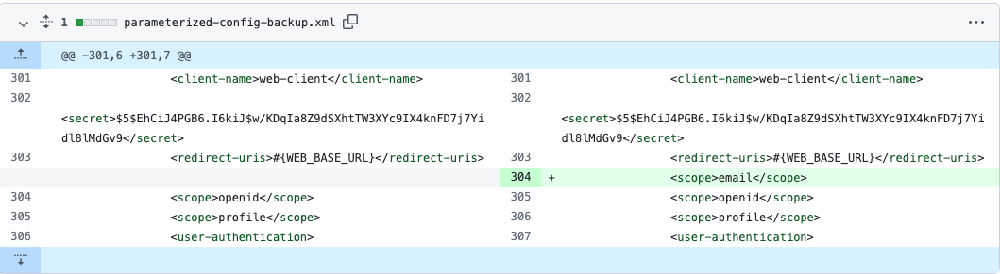

# GitOps Identity Server Configuration Management

Demonstrates a method to automate updates to a Git repo when Identity Server configuration changes.

## Prerequisites

Ensure that these tools are installed locally:

- Java 11+
- [Docker](https://www.docker.com/products/docker-desktop)
- [jq](https://stedolan.github.io/jq/download/)

Also get a `license.json` file for the Curity Identity Server.

## Overview

When configuration is saved in the Admin UI of the Curity Identity Server:

A pull request is automatically generated using a post commit script:

Configuration secrets are kept encrypted and structure maintained, to ensure readable differences:

The end-to-end process ensures that changes can be reviewed, for best reliability.

## Tutorial

See the [GitOps Configuration Management](https://curity.io/resources/learn/idsvr-gitops-configuration-management) tutorial for a walkthrough.\
With some technical setup you can run an end-to-end solution.

## Further Information

Please visit [curity.io](https://curity.io/) for more information about the Curity Identity Server.
