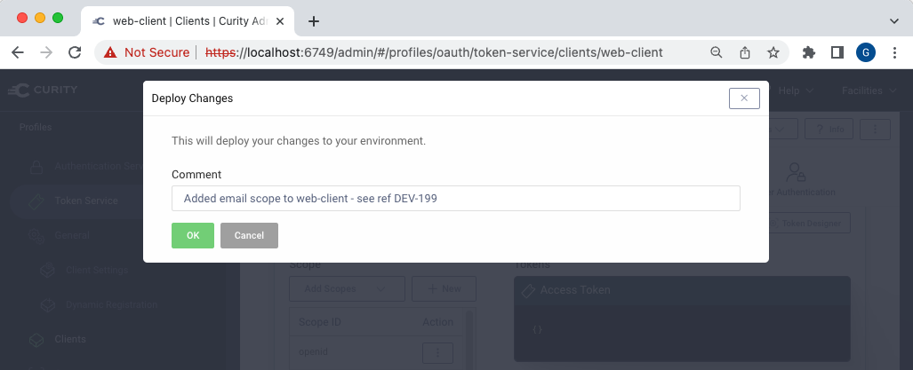

# GitOps Identity Server Configuration Management

Demonstrates a method to automate updates to a Git repo when Identity Server configuration changes.

## Prerequisites

Ensure that these tools are installed locally:

- Java 11+
- [Docker](https://www.docker.com/products/docker-desktop)
- [jq](https://stedolan.github.io/jq/download/)

Also copy a `license.json` file for the Curity Identity Server to the `idsvr` folder.

## Overview

When configuration is saved in the Admin UI of the Curity Identity Server:

A pull request is automatically generated using a post commit script:

This GitOps process ensures that all configuration changes are reviewed, to ensure reliability.

## Tutorial

See the [GitOps Configuration Management](https://curity.io/resources/learn/gitops-configuration-management/) tutorial for a walkthrough.\
This requires some technical setup to get the end-to-end solution working.

## Further Information

Please visit [curity.io](https://curity.io/) for more information about the Curity Identity Server.
