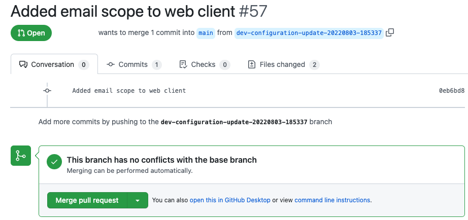

# GitOps Configuration Management

Demonstrates some advanced techniques for managing configuration for the Curity Identity Server.\
This provides a secure and maintainable setup that avoids duplication, with reliable change management.\
It also eliminates most risk when adding new environments to your deployment pipeline.

## Prerequisites

To run the end-to-end setup ensure that these tools are installed locally.\
Also install Java 11+ if you want to use the advanced backup to a Git repo.

- [Docker](https://www.docker.com/products/docker-desktop)
- [openssl](https://www.openssl.org/source/)
- [jq](https://stedolan.github.io/jq/download/)
- [xmlstarlet](http://xmlstar.sourceforge.net/)

You will also need a `license.json` file for the Curity Identity Server.

## Documentation

The following resources explain the concepts and automation in further detail:

- [Configuration Best Practices](https://curity.io/resources/learn/configuration-best-practices)
- [GitOps Configuration Tutorial](https://curity.io/resources/learn/gitops-configuration-management)

## Overview

### First Deployment

Run the first deployment, which performs auto-configuration to provide a working system.\
This also creates a configuration encryption key.

```bash
cd initial-config
./first-deployment.sh
```

Then login to the Admin UI at http://localhost:6749/admin with credentials `admin / Password1`.\
Complete the initial setup and upload a license file.\
Under `Token Service / Clients`, create a web client and assign these values:

- A client ID of `web-client`
- A client secret
- Redirect URI and allowed origins set to `https://web.example-dev.com`
- Scopes of `openid profile`

Then select `Changes / Download` to back up the configuration to an XML file.\
Save this to `initial-config/initial-config-backup.xml`.

### Second Deployment

Then redeploy the system without running autoconfiguration.\
This will use the license file in the config backup file and the same configuration encryption key:

```bash
./second-deployment.sh
```

### Split and Parameterize the Configuration

An example split configuration is provided at `git-repo/config`, which consists of multiple XML files:

- base.xml
- environments.xml
- facilities.xml
- tokenservice.xml
- authenticationservice.xml

Update the file at `git-repo/dev/environment.json` with values from your `initial-config-backup.xml` file.\
For demo purposes this can be done by running the following script:

```bash
./migrate-configuration.sh
```

This creates the following plaintext environment data at `./github-repo/dev/environent.json`:

```json
{
  "RUNTIME_BASE_URL": "http://localhost:8443",
  "DB_USERNAME": "SA",
  "WEB_BASE_URL": "https://web.example-dev.com"
}
```

It also creates the following secure environment variables at `./vault/dev/secure.json`:

```json
{
  "ADMIN_PASSWORD": "$5$kNu7FA5I$/9quUgGP1ggocyzcIrVgnPdguHyBL742aiX7rQJMA86",
  "DB_CONNECTION": "data:text/plain;aes,v:S.a25oeGR4d053 ...",
  "DB_PASSWORD": "data:text/plain;aes,v:S.NWNrVmM4YzVpZG0xWldJdQ==._5oFM ...",
  "WEB_CLIENT_SECRET": "$5$kZo78W5Fug3iAY3T$gVXXkZXYW1SrF/AGiRl6NilGsSmLuqSW0JDG7SN6B92",
  "SYMMETRIC_KEY": "data:text/plain;aes,v:S.c2xCODcwSm0wdklreFFrWA==.SjN12C2S ...",
  "SSL_KEY": "data:application/p12;aes,v:S.NGN0QzJvZUNTMm85a1FjOA==.O6v7dR ...",
  "SIGNING_KEY": "data:application/p12;aes,v:S.ZWw3WTU4WXFzdFZyazBMOQ==.lDKmjCGbFVP54OoITOwnOQ==.vdRzw1juq ...",
  "VERIFICATION_KEY": "data:application/pem;aes,v:S.OWlMMzlqaThhSUxZbmR4TA==.0Hi0WUsPSfxw75t9eSfymw== ..."
}
```

### Run Deployment with Parameters

The example parameterized deployment requires a stage of the deployment pipeline as an input parameter.\
A Docker image is built containing the parameterized configuration and other resources.\
A license key for the Curity Identity Server is also provided as a parameter.\
The deployment uses the configuration encryption key created earlier:

```bash
export STAGE=DEV
export LICENSE_FILE_PATH=~/curity/license.json
./build.sh
./deploy.sh
```

In the Admin UI, edit the configuration, and add the email scope to the web client.\
Upon saving, a post commit script saves the configuration to your local `./configbackup` folder:

- The `config_params.xml` file contains the parameterized configuration
- The `config_values.xml` file contains stage specific values
- The `commit_message.txt` file contains the comment used in the Admin UI

### Implement Advanced Configuration Backup

Create a GitHub repository with the contents of the `git-repo` folder.\
Edit the `Git Integration API` and configure the `src/main/resources/application.properties` file.\
Point the utility API to your repository by entering your GitHub settings:

```bash
githubBaseUrl=https://api.github.com
githubUserAccount=
githubAccessToken=
githubRepositoryName=idsvr-configuration-store
```

Redeploy the system with additional Git parameters:

```bash
export GIT_CONFIG_BACKUP=true
export GITHUB_USER_ACCOUNT_NAME=john.doe
export STAGE=DEV
export LICENSE_FILE_PATH=/Users/john.doe/Desktop/license.json
./build.sh
./deploy.sh
```

The post commit script then calls a utility API, which uses GitHub REST APIs to update the repo.\
This results in changes being submitted to a branch, and a pull request automatically created.\
This would enable a process where all configuration changes undergo people reviews:



### Create a New Environment

When configuring a new stage of the deployment pipeline, you only need to populate new environment data.\
The following script creates some crypto keys for testing, and creates a new config encryption key:

```bash
cd vault
export STAGE=STAGING
./create-development-keys.sh
```

Next generate the secure environment data for the new environment.\
The script shows how to convert keystores and secrets to the Curity Identity Server secure format:

```bash
./create-environment-data.sh
```

Once the environment setup is done, you can immediately deploy the new stage with a working configuration.\
You will need to add the self signed certificate generated at `/vault/staging/ssl.crt` to the system trust store.\
You can then login to the Admin UI for the new STAGING environment:

```bash
./deploy.sh
```

## Further Information

Please visit [curity.io](https://curity.io/) for more information about the Curity Identity Server.
